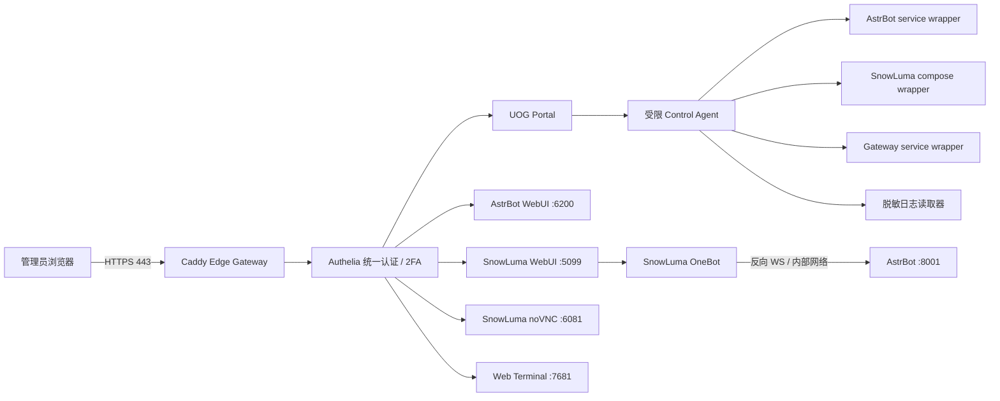

# xtw_bot 单端口统一运维面板设计文档

> 文档版本：v1.0  
> 最后整理：2026-08-20  
> 模块代号：UOG（Unified Operations Gateway，统一运维网关）  
> 文档性质：架构与实施设计；本文不代表公网入口已经开放。  
> 当前 QQ 接入决策：NapCat 已弃用，SnowLuma 是唯一现役 QQ 接入层。

## 1. 决策摘要

为 xtw_bot 增加一个统一运维入口，对公网只暴露一个 HTTPS 端口，管理员登录一次后即可：

- 查看 AstrBot、SnowLuma、统一网关和浏览器终端的状态；
- 进入 AstrBot WebUI；
- 进入 SnowLuma WebUI；
- 在首次登录或登录失效时进入 SnowLuma noVNC 扫码；
- 使用受限的浏览器终端管理服务器；
- 查看脱敏日志；
- 对允许的服务执行启动、停止和重启；
- 在面板中以卡片、标签页或分屏方式同时查看多个服务。

推荐架构为：

```text
公网 TCP 443
  → Caddy HTTPS 反向代理
  → Authelia 统一认证与二次验证
  → UOG Portal 统一面板
  → AstrBot / SnowLuma / noVNC / Web Terminal
```

对外只开放 `443/tcp`。各后台服务继续使用各自内部端口，但只绑定 `127.0.0.1`、Unix Socket 或专用 Docker 网络，不直接暴露到公网。

推荐使用域名和多个子域名进行路由，但所有子域名仍共用公网 `443`：

```text
ops.example.com              → 统一面板
auth.ops.example.com         → 统一登录
astrbot.ops.example.com      → AstrBot WebUI
snowluma.ops.example.com     → SnowLuma WebUI
desktop.ops.example.com      → SnowLuma noVNC，按需开放
terminal.ops.example.com     → 浏览器终端 / Web SSH
```

子域分流比把所有应用强行挂到 `/astrbot/`、`/snowluma/` 等路径下更可靠，因为单页应用经常使用绝对资源路径、独立 Cookie 和 WebSocket 地址。单端口的含义是只暴露一个公网 TCP 端口，不要求所有应用使用同一个 URL 路径。

## 2. 范围与非目标

### 2.1 本设计包含

- 单公网端口 HTTPS 网关；
- 统一身份认证、二次验证和角色权限；
- 多服务状态面板；
- AstrBot 和 SnowLuma WebUI 反向代理；
- SnowLuma noVNC 按需访问；
- 同机浏览器终端，以及可选的真正 Web SSH；
- 受限服务控制 API；
- 日志、审计、告警、备份和回滚；
- 公网、无公网 IPv4 和局域网三种接入模式；
- 与现有 xtw_bot 目录和未来物理机迁移的衔接。

### 2.2 本设计不包含

- 不恢复、不切换和不管理 NapCat；
- 不把 SnowLuma OneBot HTTP/WS 直接暴露到公网；
- 不把 Docker Socket 直接挂载给网页面板；
- 不允许网页传入任意 Shell 命令；
- 不关闭 AstrBot、SnowLuma 自身已有的管理员认证；
- 不默认记录完整终端内容、QQ 消息、API Key 或登录凭据；
- 不为了实现 iframe 分屏而无条件删除上游应用的 CSP 或 `X-Frame-Options`；
- 不在第一版提供系统更新、软件安装、用户管理和任意文件浏览能力。

## 3. 当前端口与目标暴露策略

### 3.1 当前或计划中的内部端口

| 服务 | 默认/当前端口 | 用途 | 公网策略 |
|---|---:|---|---|
| Caddy | `443` | 统一 HTTPS 入口 | 唯一公开端口 |
| AstrBot | `6200` | AstrBot WebUI/API | 仅本机，由 Caddy 代理 |
| AstrBot | `8001` | OneBot 反向 WebSocket | 仅 SnowLuma 可达，不进入面板 |
| SnowLuma | `5099` | SnowLuma WebUI | 仅本机/内部网络，由 Caddy 代理 |
| SnowLuma | `6081` | noVNC 扫码和 QQ 桌面 | 仅本机，二次验证后按需代理 |
| SnowLuma | `3000` | OneBot HTTP | 内部协议端口，禁止公网 |
| SnowLuma | `3001` | OneBot WebSocket | 内部协议端口，禁止公网 |
| Authelia | `9091` | 统一认证 | 仅本机/内部网络 |
| UOG Portal | `8088` | 状态面板与控制 API | 仅本机/内部网络 |
| ttyd | `7681` | 轻量浏览器终端 | 仅本机，由 Caddy 代理 |
| SSH | `22` | 原生 SSH | 仅局域网、VPN 或管理网；不必公网开放 |
| AntiPromptInjector | `18888` | 可选插件 WebUI | 默认不纳入第一版；需要时单独授权 |

SnowLuma 官方文档给出的默认 WebUI 端口是 `5099`，无头 Linux 扫码使用 noVNC `6081`。官方同时明确警告不要把 noVNC、WebUI 和 OneBot 端口裸露到公网。因此本设计只允许 Caddy 经过统一认证后代理这些页面。

### 3.2 目标监听状态

最终应满足：

```text
0.0.0.0:443                 Caddy，唯一公网监听
127.0.0.1:6200              AstrBot WebUI
127.0.0.1:5099              SnowLuma WebUI 的宿主映射
127.0.0.1:6081              SnowLuma noVNC 的宿主映射
127.0.0.1:9091              Authelia
127.0.0.1:8088              UOG Portal
127.0.0.1:7681              ttyd，可选
内部网络或指定接口:8001     AstrBot OneBot WS
内部 Docker 网络:3000/3001  SnowLuma OneBot
```

若 AstrBot 仍绑定 `0.0.0.0:6200`，实施网关前必须先收紧到 `127.0.0.1` 或通过防火墙确保外部无法绕过 Caddy 访问。

## 4. 总体架构



### 4.1 数据面与控制面分离

- 数据面：Caddy 代理已有 WebUI、WebSocket 和终端流量。
- 控制面：UOG Portal 只通过受限 Control Agent 执行预定义动作。
- 身份面：Authelia 负责登录、二次验证、会话和角色组。

Control Agent 不解析任意命令字符串，只接受固定服务 ID 和固定动作，例如：

```json
{
  "service": "astrbot",
  "action": "restart",
  "request_id": "uuid"
}
```

允许的 `service`、`action` 由服务端枚举，不能由前端拼接脚本路径或 Shell 参数。

## 5. 为什么推荐子域而不是路径前缀

### 5.1 推荐方式

```text
https://astrbot.ops.example.com/
https://snowluma.ops.example.com/
https://terminal.ops.example.com/
```

它们都连接同一个 IP 的 `443`，由 TLS SNI 和 HTTP Host 头分流。

优势：

- 上游应用仍认为自己运行在 `/` 根路径；
- 静态资源和 WebSocket 不需要复杂重写；
- 各应用 Cookie 不易冲突；
- 可以为终端、noVNC 和普通面板使用不同权限；
- 单个应用故障不会污染其他路径；
- 后续迁移主机时只需调整 DNS 和网关上游。

### 5.2 路径前缀备选

只有在没有域名或必须使用单一 Host 时才考虑：

```text
https://server.example.com/astrbot/
https://server.example.com/snowluma/
https://server.example.com/terminal/
```

风险：

- AstrBot 或 SnowLuma 可能生成以 `/` 开头的绝对资源 URL；
- SPA 路由刷新后可能 404；
- WebSocket 路径可能不接受前缀；
- Cookie path 和跨页面登录可能冲突；
- 需要重写响应正文时会非常脆弱。

ttyd 原生支持 base path，但不能据此推断其他应用也支持。第一版不采用正文替换和大范围 URL 重写。

## 6. 公网只开放一个端口的 TLS 方案

### 6.1 严格只开放 `443`

若路由器或云防火墙只能放行一个公网端口，推荐：

- 准备一个域名；
- 配置 `ops.example.com` 和 `*.ops.example.com` 指向公网地址；
- 使用 DNS-01 验证签发通配符或多域名证书；
- 路由器只转发公网 `443` 到服务器 `443`；
- 不开放公网 `80`。

Caddy 可自动管理 HTTPS，但常规 HTTP-01 模式通常需要 `80` 和 `443`。严格单端口时，应使用受支持的 DNS Provider 模块完成 DNS-01，或使用已有证书。DNS API 凭据必须单独保存，不能进入 Git、Portal 配置或浏览器。

### 6.2 可临时开放 `80`

如果允许 `80` 仅用于证书签发和 HTTP 到 HTTPS 跳转，Caddy 的标准自动 HTTPS 配置更简单。但这不再满足“公网永远只有一个端口”的严格定义，应由用户明确选择。

### 6.3 没有公网 IPv4

若处于运营商 CGNAT：

- 使用带身份认证的出站隧道；或
- 先进入 Tailscale/WireGuard，再访问内部网关；或
- 使用一台有公网 IP 的反向代理节点。

此时仍保持后台服务只监听本机，不能为了绕过 NAT 直接暴露 SnowLuma 端口。

## 7. 统一认证与权限

### 7.1 双层认证

建议保留两层：

1. Authelia 外层统一登录与 2FA；
2. AstrBot 和 SnowLuma 自身管理员密码继续保留。

外层 SSO 减少公网扫描和未认证请求，内层认证防止网关配置错误后后台直接裸露。不要因为有 Authelia 就删除上游密码。

### 7.2 角色模型

| 角色 | 权限 |
|---|---|
| `viewer` | 查看服务状态、健康信息和脱敏日志 |
| `operator` | viewer + 启动、停止、重启 AstrBot/SnowLuma |
| `terminal_admin` | operator + 进入浏览器终端，需要二次验证 |
| `owner` | 管理网关配置、证书、用户和回滚 |

终端、noVNC、服务停止和主机级动作应触发 step-up 2FA，即使当前 SSO 会话仍然有效。

### 7.3 会话要求

- HTTPS-only Cookie；
- 合理的 SameSite 和 Domain 范围；
- 空闲超时与绝对超时；
- 登录失败限制和封禁；
- 退出登录后所有子域会话立即失效；
- 控制操作使用 CSRF Token；
- 服务停止、重启和终端开启需要二次确认；
- 不在 URL 查询参数中传递 SnowLuma 密码、VNC 密码或 SSO Token。

SnowLuma 支持在 URL 中携带 WebUI 密码以快捷登录，但官方文档也指出这种做法存在历史记录和中间日志风险；公网网关设计中明确禁止使用该方式。

## 8. Caddy 反向代理设计

Caddy 负责：

- TLS 终止和证书续期；
- 根据 Host 分流；
- 调用 Authelia `forward_auth`；
- 代理 HTTP 和 WebSocket；
- 添加安全响应头；
- 输出访问日志和健康指标；
- 对不可用上游显示统一错误页。

Caddy 官方 `reverse_proxy` 支持 WebSocket 升级，因此适合 SnowLuma、noVNC、ttyd 和 AstrBot 中包含 WebSocket 的页面。

### 8.1 Caddyfile 结构草案

以下只是结构示例，不包含真实域名、密码和 DNS 凭据：

```caddyfile
(uog_auth) {
    forward_auth 127.0.0.1:9091 {
        uri /api/authz/forward-auth
        copy_headers Remote-User Remote-Groups Remote-Name Remote-Email
    }
}

ops.example.com {
    import uog_auth
    reverse_proxy 127.0.0.1:8088
}

astrbot.ops.example.com {
    import uog_auth
    reverse_proxy 127.0.0.1:6200
}

snowluma.ops.example.com {
    import uog_auth
    reverse_proxy 127.0.0.1:5099
}

desktop.ops.example.com {
    import uog_auth
    reverse_proxy 127.0.0.1:6081
}

terminal.ops.example.com {
    import uog_auth
    reverse_proxy 127.0.0.1:7681
}
```

正式配置还需要：

- Authelia 角色策略；
- trusted proxies 和真实客户端 IP 校验；
- 安全响应头；
- 访问日志脱敏；
- 上游超时和错误处理；
- DNS-01 或证书配置；
- noVNC 与终端的更严格策略；
- Portal API 的方法限制与 CSRF。

不要使用来源不明的 Caddy 身份认证插件代替官方 `forward_auth` 流程。

## 9. UOG Portal 面板

### 9.1 页面布局

建议布局：

```text
┌────────────────────────────────────────────────────────┐
│ xtw_bot Operations       当前用户    告警    退出登录  │
├──────────────┬─────────────────────────────────────────┤
│ 总览         │ 服务卡片 / 分屏工作区                  │
│ AstrBot      │                                         │
│ SnowLuma     │  AstrBot  SnowLuma  Terminal  Logs      │
│ QQ 桌面      │                                         │
│ 终端         │                                         │
│ 日志         │                                         │
│ 审计         │                                         │
└──────────────┴─────────────────────────────────────────┘
```

### 9.2 总览卡片

每个服务显示：

- 运行/停止/异常；
- 版本；
- 启动时间和 uptime；
- WebUI 健康；
- 协议连接状态；
- 最近一次重启原因；
- 最近错误摘要；
- 快捷进入、日志、重启按钮。

SnowLuma 卡片需要区分：

- 容器存活；
- WebUI 可达；
- QQ 是否登录；
- Hook 是否加载；
- OneBot 是否已连接 AstrBot。

不能再用“WebUI 能打开”代表 QQ 已经在线。

### 9.3 多页面同时查看

Portal 提供三种打开方式：

1. 卡片模式：状态和关键指标同时显示；
2. 标签页模式：在 Portal 内切换服务；
3. 分屏模式：同时显示两个或三个允许嵌入的页面。

iframe 规则：

- 只有经过测试且允许 `frame-ancestors https://ops.example.com` 的应用才能嵌入；
- 不全局删除 `X-Frame-Options` 或 CSP；
- 上游明确禁止嵌入时，Portal 显示健康卡片并用新标签页打开；
- 分屏只影响显示，不改变外层认证和服务权限；
- noVNC 和终端默认不与普通页面同时自动加载，避免后台维持高权限会话。

### 9.4 操作确认

| 动作 | 确认策略 |
|---|---|
| 查看状态 | 无二次确认 |
| 查看脱敏日志 | 无二次确认，按角色限制 |
| 重启单个服务 | 确认弹窗 + request ID |
| 停止服务 | 输入服务名确认 |
| 开启 noVNC | step-up 2FA + 15 分钟租约 |
| 开启可写终端 | step-up 2FA + 短期会话 |
| 重启主机 | 第一版不提供 |
| 删除数据/清理登录态 | 第一版不提供 |

## 10. Control Agent 设计

### 10.1 最小权限

Portal 前端不能直接访问 Docker Socket、systemd DBus 或任意 Shell。Control Agent 使用固定操作表：

```text
astrbot.status
astrbot.start
astrbot.stop
astrbot.restart
astrbot.logs

snowluma.status
snowluma.start
snowluma.stop
snowluma.restart
snowluma.logs

gateway.status
gateway.reload
gateway.logs

novnc.lease.start
novnc.lease.stop
```

### 10.2 后端执行

优先使用：

- `systemctl --user` 管理 AstrBot 和 UOG 用户服务；
- 固定路径的 Docker Compose wrapper 管理 SnowLuma；
- root 拥有的 allowlist wrapper 处理确实需要 sudo 的动作；
- Unix Socket 连接 Portal 与 Control Agent。

禁止：

- `command`、`args`、`shell` 等任意字符串字段；
- 把 `/var/run/docker.sock` 暴露给 Web 容器；
- 使用 `sudo sh -c <用户输入>`；
- 允许前端选择任意 Compose 文件路径；
- 通过日志接口读取任意文件路径。

### 10.3 操作幂等

每个控制请求包含唯一 `request_id`：

- 重复 POST 不重复重启；
- 操作进行中时同服务进入锁定状态；
- 超时不等于操作失败，后端继续核验实际状态；
- 前端刷新后能通过 request ID 查询结果；
- 所有动作记录操作者、来源 IP、目标、动作和结果。

## 11. SnowLuma 专项设计

### 11.1 唯一 QQ 接入层

NapCat 已弃用，不再出现在启动编排、Portal 服务卡片和故障切换中。需要完成：

- 从默认启动脚本中移除 NapCat；
- 停止并禁用 NapCat Docker/AppImage 自动拉起；
- 归档其配置和数据，暂不立即删除；
- 确认没有残留进程监听 `3001`、`7000` 或占用 QQ 登录态；
- AstrBot OneBot 连接统一指向 SnowLuma。

### 11.2 Docker 隔离

SnowLuma 官方 Docker 方案需要 `SYS_PTRACE`、放宽 seccomp 和约 1 GiB `/dev/shm`。这意味着 SnowLuma 容器权限高于普通 Web 服务，因此：

- SnowLuma 不与 Portal、Authelia、Caddy 共用容器；
- 不给 SnowLuma 挂载 UOG 配置、证书、SSH Key 或 Docker Socket；
- 数据卷只包含 SnowLuma/QQ 必需数据；
- 固定 SnowLuma 镜像版本或 digest，不使用长期漂移的 `latest`；
- WebUI 和 noVNC 的宿主映射只绑定 `127.0.0.1`；
- OneBot 端口只在内部网络开放；
- 日志设置大小和保留数量限制。

示意映射：

```yaml
ports:
  - "127.0.0.1:5099:5099"
  - "127.0.0.1:6081:6081"
```

如果 AstrBot 与 SnowLuma 都容器化，优先让两者通过专用 Docker 网络和服务名通信，不发布 `3000/3001/8001` 到公网。

### 11.3 noVNC 按需租约

noVNC 权限接近“能看到和操作 QQ 桌面”，风险高于普通 WebUI。建议：

- 默认 Caddy 路由返回“未开启”；
- 管理员 step-up 2FA 后申请 15 分钟访问租约；
- 租约到期自动断开路由或停止 noVNC 代理；
- 同时最多一个 noVNC 会话；
- 不在 Portal 保存 VNC 密码；
- VNC 密码必须改变默认值并单独保管；
- noVNC 访问和扫码时间写入审计日志，但不截屏。

## 12. AstrBot 专项设计

- 将 Dashboard host 收紧到 `127.0.0.1`；
- `6200` 仅由 Caddy 访问；
- `8001` 只允许 SnowLuma/内部网络连接；
- 保留 AstrBot 自身 WebUI 密码；
- 插件页面和 WebSocket 经过反向代理逐项测试；
- 通过 Portal 重启 AstrBot 时，SnowLuma 不应被无条件重启；
- 重启后 Portal 检查 `6200`、`8001` 和 SnowLuma 反向连接是否恢复；
- AstrBot 日志接口必须过滤 API Key、完整 Prompt、人格和用户消息原文。

## 13. 浏览器终端与 Web SSH

浏览器终端是本设计中风险最高的功能，必须和普通 WebUI 分级。

### 13.1 方案 A：ttyd 同机终端，推荐第一版

适用场景：只有一名管理员，目标是管理当前这台服务器。

优点：

- 体积小；
- WebSocket 终端体验好；
- 支持反向代理认证 Header、Origin 检查、base path 和客户端数量限制；
- 可直接以非 root 用户运行。

要求：

- 以 `developer` 或单独的 `xtw-operator` 用户运行，禁止 root；
- 默认只读，确认需要后才启用可写；
- 使用 Authelia `terminal_admin` 组和 step-up 2FA；
- 开启 Origin 检查；
- 最大客户端数设为 1；
- 会话空闲自动结束；
- 不允许 URL 参数传递任意启动命令；
- sudo 只允许固定运维 wrapper，不允许无密码任意 sudo。

严格来说 ttyd 是 Web 终端，不一定经过 SSH 协议。如果需求只是控制本机，它比“浏览器再 SSH 回本机”简单。

### 13.2 方案 B：Apache Guacamole 真正 Web SSH

适用场景：需要管理多台主机、使用真正 SSH 连接、保存连接定义或进行会话记录。

优点：

- 原生支持 SSH；
- 可集中管理多个连接；
- 支持 OpenID Connect/SAML 等 SSO 方式；
- 支持终端行为控制和会话记录。

代价：

- 组件更多，通常需要 guacamole、guacd 和数据库；
- 内存和运维复杂度高于 ttyd；
- SSH 私钥和主机指纹需要专门保护。

本项目第一版推荐 ttyd；只有明确需要多主机或严格 SSH 会话管理时再升级到 Guacamole。

### 13.3 原生 SSH 端口

- 公网不必开放 `22`；
- 保留局域网、Tailscale/WireGuard 或物理控制台恢复通道；
- Web 终端故障时不能成为唯一的主机入口；
- 禁止公网 root 密码登录；
- SSH Key 与 UOG 登录凭据分开保管。

## 14. 日志与审计

### 14.1 网关访问日志

记录：

- 时间；
- 经过代理后的真实客户端 IP；
- 用户标识；
- 目标服务；
- HTTP 方法、状态码、耗时和响应大小；
- request ID；
- 上游错误类别。

不记录：

- Authorization/Cookie；
- SnowLuma WebUI 密码；
- VNC 密码；
- URL Token；
- AstrBot API Key；
- QQ 消息正文；
- 终端输入正文。

### 14.2 控制审计

所有 start/stop/restart/reload/noVNC lease 操作记录：

- 操作者；
- 角色；
- 来源 IP；
- 目标服务；
- 动作；
- request ID；
- 开始和完成时间；
- 执行前后状态；
- 成功或错误代码。

### 14.3 日志轮转

- Caddy、Authelia、Portal、Control Agent、AstrBot 和 SnowLuma 分开轮转；
- 设置单文件大小、保留文件数量和最长天数；
- 错误堆栈经过敏感字段过滤；
- Portal 只能读取允许的服务日志和限定行数；
- 禁止 `?file=/任意路径` 式日志接口。

## 15. 健康检查

### 15.1 分层健康状态

| 状态 | 含义 |
|---|---|
| process/container | 进程或容器是否存在 |
| webui | HTTP 页面/API 是否可达 |
| protocol | OneBot/WebSocket 是否连接 |
| account | QQ 是否登录 |
| functional | 能否完成最小只读功能检查 |

Portal 不把其中任意一项单独等同于“服务完全健康”。

### 15.2 检查频率

- Portal 页面打开时立即获取；
- 后台 15～30 秒轻量检查；
- 协议和账号状态使用已有 API/日志状态，不主动发测试 QQ 消息；
- 连续失败达到阈值后才告警，避免短暂重启造成抖动；
- 控制操作完成后进行快速重试并显示恢复过程。

## 16. 面板技术实现建议

### 16.1 Portal

推荐实现为独立的小型服务，不依赖 AstrBot Python 环境：

- 静态前端 + 独立 API；
- 后端可选 Go 单文件或独立 Python venv；
- 仅监听 `127.0.0.1:8088` 或 Unix Socket；
- 用户身份只信任来自 Caddy/Authelia 的受控 Header；
- 直接访问 Portal 后端端口时拒绝请求；
- API 使用 CSRF、防重放 request ID 和角色校验。

### 16.2 建议目录

```text
xtw_bot/
├── gateway/
│   ├── README.md
│   ├── Caddyfile.example
│   ├── compose.yml
│   ├── authelia/
│   │   ├── configuration.example.yml
│   │   └── users.example.yml
│   ├── portal/
│   ├── control-agent/
│   ├── service-definitions/
│   │   ├── astrbot.yml
│   │   ├── snowluma.yml
│   │   └── gateway.yml
│   └── systemd/
├── data/
│   └── gateway/            # 会话、审计和证书数据，不进入 Git
├── logs/
│   └── gateway/
└── backups/
    └── gateway/
```

真实密码、Cookie Secret、JWT Secret、DNS API Token、VNC 密码和 SSH Key 不能放入 example 文件。

## 17. 网络与防火墙

### 17.1 主机防火墙

公网接口：

```text
ALLOW tcp/443
DENY  tcp/6200
DENY  tcp/5099
DENY  tcp/6081
DENY  tcp/3000
DENY  tcp/3001
DENY  tcp/7000
DENY  tcp/8001
DENY  tcp/18888
```

SSH `22` 根据实际情况只允许局域网、VPN 地址段或管理跳板机。

### 17.2 Docker 网络

- `snowluma-internal`：SnowLuma 与 AstrBot 协议通信；
- `uog-auth`：Caddy、Authelia、Portal；
- Control Agent 尽量走 Unix Socket；
- SnowLuma 不加入 `uog-auth` 的管理数据网络，除非仅为 WebUI 代理建立最小连接；
- 不使用 `network_mode: host` 作为长期默认，除非技术验证证明 SnowLuma 必须如此；
- 容器发布端口明确绑定 `127.0.0.1`。

## 18. 安全威胁与防护

| 威胁 | 防护 |
|---|---|
| 暴力破解 | Authelia 2FA、登录限制、封禁、强密码 |
| 绕过网关直连后台 | 后台绑定 loopback、主机防火墙、容器内部网络 |
| Cookie 被盗 | HTTPS-only、短会话、SameSite、退出全局失效 |
| CSRF 重启服务 | CSRF Token、POST、角色校验、确认和 request ID |
| 命令注入 | Control Agent 只允许枚举动作，不接受 Shell 字符串 |
| Docker Socket 提权 | 不向 Portal 暴露 Docker Socket |
| iframe 点击劫持 | 精确 CSP `frame-ancestors`，不全局删除保护头 |
| WebSocket 跨站 | Origin 检查、同一认证门禁、独立子域 |
| noVNC 控制 QQ | step-up 2FA、按需租约、单会话、独立密码 |
| 终端提权 | 非 root、最小 sudo allowlist、短会话、最大客户端 1 |
| 日志泄密 | Header/Query 脱敏、禁止 URL 密码、有限日志接口 |
| DNS/证书凭据泄漏 | Secret 文件最小权限、独立备份、不进 Git |
| SnowLuma 高权限容器影响网关 | 容器、网络和挂载隔离，固定镜像版本 |

## 19. 配置和 Secret 管理

Secret 至少包括：

- Authelia Session Secret；
- Storage Encryption Key；
- 用户密码哈希；
- DNS API Token；
- VNC 密码；
- SnowLuma WebUI 密码；
- Portal CSRF/签名密钥；
- 可选 SSH 私钥。

要求：

- 以独立 Secret 文件或 Docker Secret 保存；
- 文件权限至少 `0600`，目录最小权限；
- example 配置只放占位符；
- 备份加密；
- 日志和 `docker inspect` 中避免出现明文；
- 定期轮换；
- DNS API Token 使用最小 DNS Zone 权限。

## 20. 备份与恢复

### 20.1 需要备份

- Caddyfile 和版本；
- Caddy 证书数据，或至少保证可重新签发；
- Authelia 配置、用户数据库和 Secret；
- Portal 配置和服务定义；
- Control Agent allowlist；
- systemd unit；
- 脱敏审计数据库；
- SnowLuma Compose、版本锁和持久化卷；
- AstrBot 与 SnowLuma 的连接配置。

### 20.2 不需要进入便携配置备份

- 临时访问日志；
- Portal 前端缓存；
- noVNC 临时会话；
- ttyd 会话状态；
- 可重新生成的静态资源缓存。

### 20.3 恢复顺序

```text
恢复 Secret 与配置
→ 启动 Authelia
→ 启动 Caddy
→ 启动 Portal / Control Agent
→ 启动 AstrBot
→ 启动 SnowLuma
→ 验证 OneBot 连接
→ 最后按需开启 noVNC / Terminal
```

## 21. 实施阶段

### 阶段 0：前置决策

- [ ] 准备域名和 DNS 控制权限。
- [ ] 确认是否严格只开放 443，若是则采用 DNS-01。
- [ ] 确认公网 IPv4、IPv6、CGNAT 或隧道条件。
- [ ] 确认第一版使用 ttyd，还是直接使用 Guacamole。
- [ ] 确认 SnowLuma 现有安装路径、Compose 文件和实际版本。
- [ ] 归档并禁用 NapCat 启动入口。

### 阶段 1：收紧后台端口

- [ ] AstrBot 6200 绑定 loopback。
- [ ] SnowLuma 5099/6081 只发布到 127.0.0.1。
- [ ] 3000/3001/8001 只在内部协议网络可达。
- [ ] 防火墙阻断所有后台端口的公网访问。
- [ ] 保留本地恢复通道。

### 阶段 2：Caddy 与 TLS

- [ ] 固定 Caddy 版本。
- [ ] 配置域名子域路由。
- [ ] 配置 DNS-01 或证书。
- [ ] 验证 HTTP、WebSocket、证书续期和上游故障页。
- [ ] 确认公网扫描只看到 443。

### 阶段 3：Authelia

- [ ] 配置 owner/operator/viewer/terminal_admin 组。
- [ ] 启用 2FA。
- [ ] 为终端/noVNC 配置更严格策略。
- [ ] 验证登录、退出、超时、封禁和跨子域会话。
- [ ] 保留上游应用自身密码。

### 阶段 4：只读 Portal

- [ ] 实现服务卡片和健康检查。
- [ ] 实现脱敏日志查看。
- [ ] 实现标签页和可用时的分屏。
- [ ] 不加入控制按钮，先观察 24～72 小时。

### 阶段 5：受限控制

- [ ] 实现 Control Agent allowlist。
- [ ] 加入 start/stop/restart 和 noVNC lease。
- [ ] 加入 CSRF、角色、确认和幂等 request ID。
- [ ] 验证前端无法传入任意命令或路径。

### 阶段 6：浏览器终端

- [ ] 以非 root 用户部署 ttyd。
- [ ] 配置 Origin 检查、最大客户端 1 和空闲超时。
- [ ] 为终端启用 step-up 2FA。
- [ ] 限制 sudo；保留原生 SSH/VPN 恢复入口。
- [ ] 如需多主机，再评估 Guacamole。

### 阶段 7：灰度公网开放

- [ ] 先从局域网测试。
- [ ] 再允许一个固定公网来源或 VPN 用户。
- [ ] 完成安全测试和日志检查。
- [ ] 最后开放给管理员常用网络。
- [ ] 设置告警和定期更新流程。

## 22. 测试矩阵

| 类别 | 测试 | 预期 |
|---|---|---|
| 端口 | 扫描公网 IP | 只看到 443，按策略决定是否看到 22 |
| 认证 | 未登录访问所有子域 | 全部进入统一登录，不泄漏上游页面 |
| 2FA | viewer 访问终端/noVNC | 被拒绝或要求 step-up |
| 退出 | 从一个子域退出 | 所有子域会话失效 |
| WebSocket | AstrBot/SnowLuma/noVNC/ttyd | 连接稳定，不被代理截断 |
| iframe | 分屏加载 | 只嵌入明确允许的服务，不删除保护头 |
| CSRF | 跨站提交 restart | 被拒绝 |
| 命令注入 | service/action 中加入 Shell 字符 | 被 schema 拒绝，不进入执行层 |
| 路径穿越 | 日志路径传 `../` | 被拒绝，只能选择固定服务日志 |
| 幂等 | 重复点击 restart | 只执行一次 |
| 上游宕机 | AstrBot/SnowLuma 停止 | Portal 显示故障，不泄漏栈和内部路径 |
| SnowLuma | WebUI 可达但 QQ 离线 | 卡片正确区分状态 |
| noVNC | 租约到期 | 会话自动失效 |
| 终端 | 非 owner 尝试 sudo | 只允许精确 allowlist 或被拒绝 |
| Secret | 检查 URL、日志、Git | 无密码、Token 和 Cookie |
| TLS | 证书续期演练 | 不需要开放后台端口，不中断主要访问 |
| 恢复 | 新目录/新主机恢复 | 能重新建立统一入口和服务连接 |

## 23. 验收标准

正式上线必须同时满足：

- 公网只开放批准的单一 HTTPS 入口 `443`；
- AstrBot、SnowLuma、noVNC、OneBot 和 Portal 后端端口不能绕过网关访问；
- 登录一次可以访问授权的多个服务，终端/noVNC 仍需更高权限；
- Portal 能同时展示多个服务的状态，并在允许嵌入时提供分屏；
- AstrBot 和 SnowLuma WebSocket 经 Caddy 稳定工作；
- SnowLuma 的容器、WebUI、QQ 登录、Hook 和 OneBot 状态能分别观测；
- Portal 不持有 Docker Socket，也不能执行任意 Shell；
- 服务控制操作有角色、CSRF、确认、幂等和审计；
- 浏览器终端不是 root，且不是服务器唯一恢复入口；
- noVNC 默认关闭或不可路由，只有短期授权后可访问；
- URL、访问日志、审计日志和 Git 中不存在明文凭据；
- NapCat 不在启动编排、状态面板和故障切换中出现；
- 网关配置可以随 xtw_bot 迁移到另一台 Linux 主机。

## 24. 回滚方案

若公网网关出现问题：

1. 防火墙立即停止公网 443 转发或关闭 Caddy；
2. 保留后台服务的 loopback 监听，不改动 AstrBot/SnowLuma 数据；
3. 通过局域网、VPN、原生 SSH 或物理控制台登录；
4. 将 Caddy/Authelia/Portal 回滚到上一版配置；
5. 在本机验证后再恢复公网入口。

回滚网关不应要求重新扫码 QQ、重建 Iris、重装 AstrBot 或恢复 NapCat。

## 25. 实施前仍需确认

- 实际使用的域名和 DNS 服务商；
- 是否拥有公网 IPv4/IPv6，还是需要隧道；
- 是否严格禁止公网 80；
- SnowLuma 当前是否已安装，实际 Compose 路径和镜像版本；
- AstrBot 与 SnowLuma 的最终 OneBot 连接方式；
- 第一版浏览器终端选 ttyd 还是 Guacamole；
- 哪些 WebUI 必须分屏嵌入，哪些允许新标签页；
- 服务控制是否只需要 AstrBot/SnowLuma，还是还要加入 OA、Cost Control 等辅助服务；
- 审计日志保留天数和可接受的终端记录范围。

这些条件确认后再生成可直接部署的 Caddyfile、Authelia 配置、Compose 和 Portal 服务定义。

## 26. 参考资料

- [Caddy reverse_proxy 官方文档](https://caddyserver.com/docs/caddyfile/directives/reverse_proxy)
- [Caddy forward_auth 官方文档](https://caddyserver.com/docs/caddyfile/directives/forward_auth)
- [Caddy Automatic HTTPS 官方文档](https://caddyserver.com/docs/automatic-https)
- [Authelia Caddy 集成文档](https://www.authelia.com/integration/proxies/caddy/)
- [Authelia Proxy Authorization 参考](https://www.authelia.com/reference/guides/proxy-authorization/)
- [SnowLuma 快速开始](https://snowluma.github.io/guide/quickstart.html)
- [SnowLuma Docker 部署](https://snowluma.github.io/guide/deploy/docker.html)
- [ttyd 官方仓库与参数说明](https://github.com/tsl0922/ttyd)
- [Apache Guacamole SSH 配置](https://guacamole.apache.org/doc/gug/configuring-guacamole.html#ssh)
- [Apache Guacamole SSO](https://guacamole.apache.org/doc/gug/sso.html)

