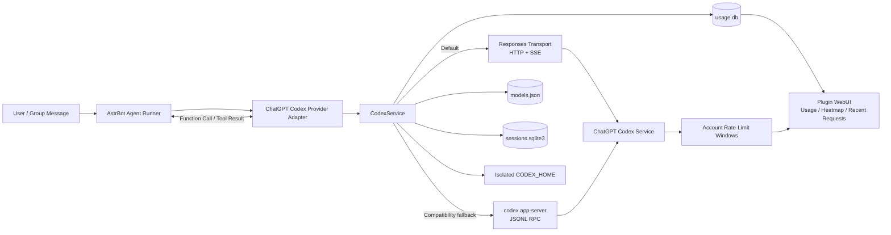
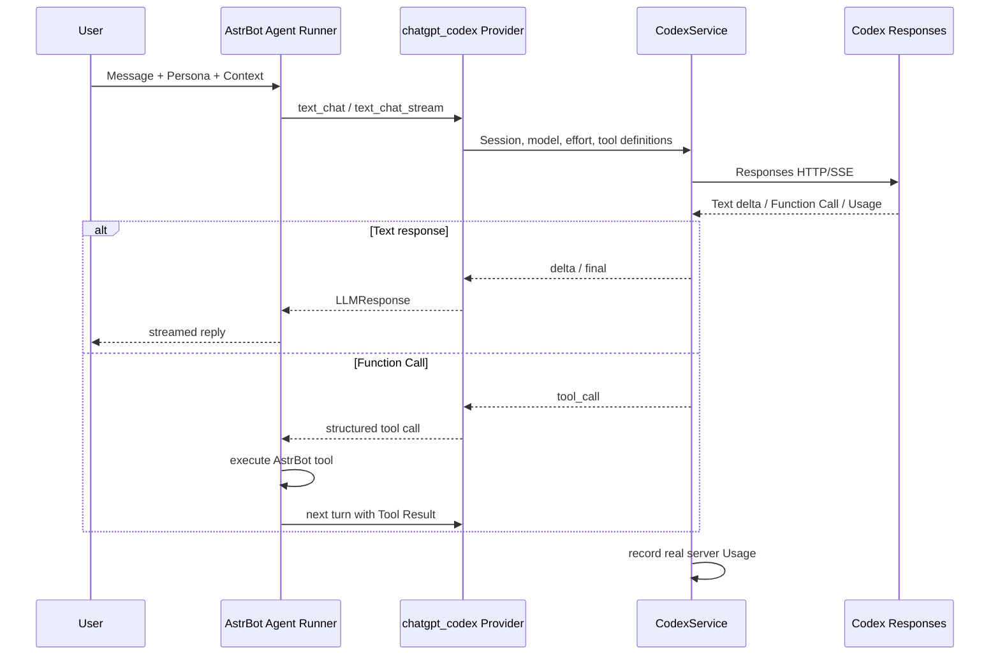
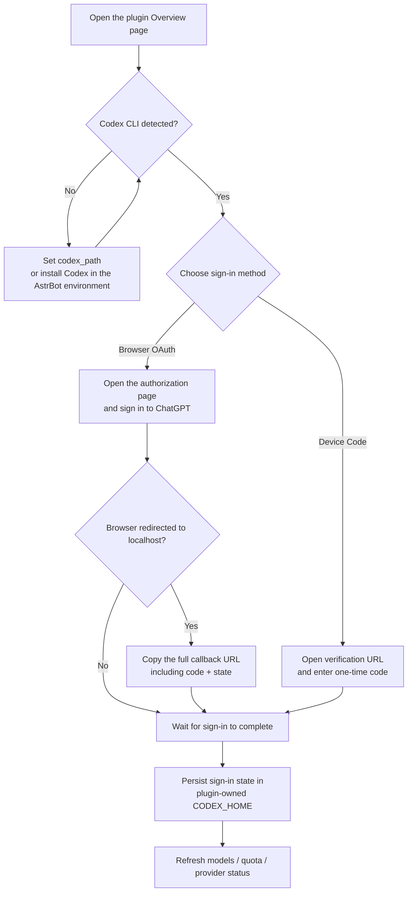
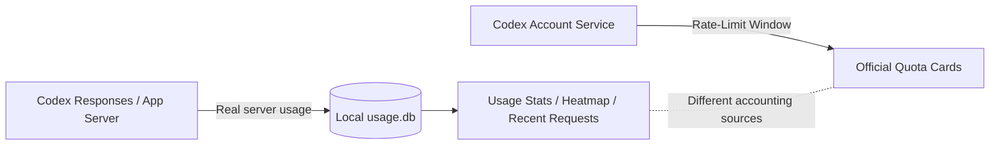

<div align="center">

# AstrBot ChatGPT Codex Bridge

**Use the Codex models available to your ChatGPT account directly inside AstrBot.**<br>
Built on the official Codex sign-in flow, with a lightweight Responses transport, Codex App Server fallback, dynamic model discovery, quota reporting, local usage analytics, and native AstrBot tool-call bridging.

[简体中文](README.md)

[](https://github.com/longzhou23/astrbot_plugin_chatgpt_codex/releases)
[](https://github.com/AstrBotDevs/AstrBot)
[](https://github.com/openai/codex)
[](https://github.com/longzhou23/astrbot_plugin_chatgpt_codex)

</div>
> [!IMPORTANT]
> This plugin uses the **Codex sign-in state of your ChatGPT account**. It is not an OpenAI API-key proxy.<br>
> ChatGPT Plus / Pro subscriptions and the OpenAI API are separate products with separate authorization, quota, and billing systems. The models, plan information, and rate limits actually available to the account are always determined by the Codex server.

---

## ✨ Features

- **Native AstrBot Provider** — registers a `chatgpt_codex` Provider Adapter that can be selected directly as an AstrBot chat model.
- **Official ChatGPT sign-in** — supports browser OAuth and Device Code; no copying cookies, access tokens, or refresh tokens.
- **Three backend modes**:
  - `transport`: recommended default; sends Codex Responses requests directly over HTTP/SSE;
  - `app_server`: uses the official `codex app-server` agent loop;
  - `auto`: tries Transport first, then performs a single App Server fallback on backend failure.
- **Dynamic model discovery** — model IDs and reasoning efforts come from the server-side `model/list` response instead of a hard-coded catalog.
- **Streaming responses** — native incremental output whenever the AstrBot call path supports streaming.
- **AstrBot tool bridge** — structured function calls are returned to AstrBot's Agent Runner instead of creating a second tool-execution loop inside Transport.
- **Multimodal input** — supports text, images, audio, and tool-use content, with safe fallback behavior for attachment types not represented by the current Codex protocol.
- **Local Usage dashboard** — tracks input, cached input, output, reasoning, total tokens, cache hit ratio, recent requests, and a yearly activity heatmap.
- **Official quota reporting** — server rate-limit windows are displayed separately from local Usage so the two accounting sources are not conflated.
- **Lightweight Harness** — removes prompt sources that are useful for coding agents but unnecessary for normal AstrBot chat, reducing prompt overhead.
- **Safe defaults** — local Codex shell, filesystem writes, MCP, browser/computer control, and similar local capabilities are disabled by default.
- **Isolated session mapping** — AstrBot sessions are separated from Codex thread/session state, with configurable rotation, idle TTL, maximum age, and manual reset.

---

## 🧩 How it works



### Normal chat request flow



### Why there is no second Agent Loop

AstrBot already has an Agent Runner. The default Transport path is intentionally limited to model inference and structured tool-call conversion:

```text
AstrBot Agent Runner
        │
        ├── Persona / System Prompt
        ├── Conversation Context
        ├── AstrBot Tools
        │
        ▼
ChatGPT Codex Provider
        │
        └── Responses Transport  ← inference only; no duplicate Agent Loop
```

This avoids injecting the same instructions twice, running duplicate tool loops, and inflating context unnecessarily.

---

## 🚀 Installation

### 1. Install Codex CLI

The initial sign-in flow depends on the official Codex App Server, so **an executable Codex CLI must be available in the same environment that runs AstrBot**.

macOS / Linux:

```bash
curl -fsSL https://chatgpt.com/codex/install.sh | sh
```

Or install with npm:

```bash
npm install -g @openai/codex
```

Verify the installation:

```bash
codex --version
```

If the AstrBot service account cannot resolve `codex`, set `codex_path` in the plugin settings to the absolute executable path.

### 2. Install the plugin

```bash
git clone --branch v0.3.0-beta.2 --depth 1 \
  https://github.com/longzhou23/astrbot_plugin_chatgpt_codex.git
```

Place the directory at:

```text
AstrBot/data/plugins/astrbot_plugin_chatgpt_codex
```

Then restart AstrBot.

On initialization, the plugin registers the `ChatGPT Codex Subscription` provider. Existing user configuration is not overwritten.

---

## 🔐 First sign-in

The plugin WebUI is the recommended setup path.



### Browser OAuth

1. Open the plugin **Overview** page.
2. Click the ChatGPT sign-in button.
3. Complete authorization in the browser.
4. If the browser ends on a `localhost` URL, paste the **entire URL from the address bar** back into the plugin page.
5. Wait until the page reports that the account is signed in.

> [!WARNING]
> The callback must include the complete `?code=...&state=...` query. Never post that URL, tokens, cookies, or `CODEX_HOME/auth.json` in GitHub Issues, group chats, or ordinary logs.

### Device Code

Device Code is useful for remote or headless servers. Select `device_code`; the plugin will display a verification URL and one-time code, then follow the on-screen instructions.

---

## 🐳 Docker deployment

The plugin can only see the **PATH and filesystem inside the AstrBot container**, not the host environment.

Check the container that actually runs AstrBot:

```bash
docker compose exec astrbot sh
command -v codex
codex --version
```

For custom images, install Codex CLI in the Dockerfile rather than only modifying a running container:

```dockerfile
RUN npm install -g --include=optional @openai/codex@0.149.1
```

The plugin stores its `CODEX_HOME` under AstrBot's persistent data directory, so make sure `/AstrBot/data` is mounted correctly.

If a proxy is required, remember that `127.0.0.1` inside the container refers to **the container itself**, not automatically to the host proxy.

---

## ⚙️ Backend modes

| Mode | Recommended use | Inference path | Codex CLI requirement |
| --- | --- | --- | --- |
| `transport` | **Default; normal chat** | Responses HTTP/SSE | Required for initial sign-in; inference itself does not start App Server |
| `app_server` | Compatibility / stable Agent Loop | `codex app-server` JSONL RPC | Required during inference |
| `auto` | Automatic fallback | Transport first, then one App Server fallback | Depends on the backend ultimately used |

### `transport`

The lightweight path sends Codex Responses requests directly:

- does not create Codex thread/turn objects as part of the Transport inference protocol;
- does not launch App Server as the inference backend for every chat request;
- does not expose local Codex shell, filesystem, MCP, or similar host capabilities;
- returns AstrBot tools as function calls for AstrBot's Agent Runner to execute;
- is the recommended path for bots, group chat, and ordinary Agent workflows.

### `app_server`

Uses the official `codex app-server` JSONL RPC surface for thread/turn lifecycle and streaming. Select it explicitly when you need the native Codex agent loop or when a Transport compatibility issue appears.

### `auto`

Attempts Transport first. On authentication, model, protocol, network, or similar backend failure, it performs one App Server fallback. Quota exhaustion is never retried indefinitely.

---

## 🪶 Lightweight Harness

Default:

```text
harness_mode = lightweight
```

This mode is designed for AstrBot chat and disables prompt sources that are unnecessary in a coding-agent context, including:

- permission instructions;
- app instructions;
- collaboration-mode instructions;
- skill instructions;
- environment context;
- project docs;
- memories;
- MCP servers;
- Codex app tools;
- optional tools such as `update_plan` and `request_user_input`.

It also supplies a minimal base instruction that tells the model to follow the AstrBot Persona / System Prompt, use only tools explicitly supplied for the current request, and not assume access to a shell, filesystem, browser, or local host environment.

If you explicitly need the native Codex coding-agent behavior, switch to:

```text
harness_mode = codex
```

---

## 📊 Usage and heatmap

The plugin writes **usage values actually returned by the server** to local SQLite. It does not estimate tokens from character counts or context size.

### Usage fields

| Field | Meaning |
| --- | --- |
| Input | Input tokens reported by the server |
| Cached input | Cached subset of Input |
| Output | Output tokens |
| Reasoning | Reasoning breakdown within Output accounting |
| Processed total | Server total tokens; Cached / Reasoning are not added again |
| Requests | Number of requests observed locally |
| Cache ratio | `cached_input_tokens / input_tokens` |

> [!NOTE]
> `Cached input` is a subset of `Input`; `Reasoning` is a breakdown within output accounting. Neither is added again to `Processed total`.

### Yearly activity heatmap

The Overview page reads up to 365 days of daily Usage and renders a 52-week activity grid:

```text
            Jan       Feb       Mar                    Aug
Mon         ■ ■       ■ ■ ■     ■                      ■ ■
Wed       ■ ■ ■       ■ ■       ■ ■                  ■ ■ ■
Fri         ■         ■ ■ ■       ■                    ■

          Less  ▫ ▪ ▪ ▪ ■  More
```

The WebUI supports:

- **Daily** — color by tokens for each day;
- **Weekly** — color cells using the total for their week;
- **Cumulative** — color by running total inside the displayed window;
- future dates are ignored;
- missing dates are filled with zero;
- duplicate dates are accumulated;
- heat levels are quantized dynamically relative to the peak of the currently displayed window.

Local Usage and official quota are **different data sources**:



Differences between them are therefore expected. Remaining account quota should be interpreted from the server-provided rate-limit data.

---

## 🧠 Sessions and context

The plugin maps AstrBot's unified session identifier to isolated Codex thread/session state:

- requests within the same session are serialized;
- different sessions may run concurrently;
- plugin-owned background calls without a `session_id` use one-off ephemeral session keys and never share state with normal chat sessions;
- `max_thread_turns`, `thread_idle_ttl`, and `thread_max_age` can rotate persisted state automatically;
- `/gpt reset` manually resets the current session state.

Persistent data layout:

```text
data/plugin_data/astrbot_plugin_chatgpt_codex/
├── CODEX_HOME/            # Isolated ChatGPT Codex sign-in state
├── models.json            # Cached server model catalog
├── runtime_settings.json  # Current model / effort / onboarding state
├── sessions.sqlite3       # AstrBot session mapping
└── usage.db               # Local token Usage
```

---

## 🛠️ AstrBot tools and multimodal input

The Provider advertises support for:

```text
text / image / audio / tool_use
```

### Tool calls

When Transport returns a Function Call, the plugin converts the function name, arguments, and call ID into an AstrBot `LLMResponse`. AstrBot's Agent Runner then executes the tool and sends the Tool Result into the next model turn.

This means:

- AstrBot remains in control of AstrBot tools;
- the plugin does not execute unknown host commands on its own;
- tool-call history and opaque reasoning signatures are retained for subsequent Responses calls when required by the protocol.

### Multimodal input

- images → converted to the current Codex protocol's `input_image` form;
- audio → converted to `input_audio`;
- replies / quotes → preserved as quoted text;
- when the current protocol has no generic file/video ContentItem → converted to a short attachment marker instead of silently dropping the user's input.

---

## 🔒 Security boundary

Default security policy:

| Capability | Default |
| --- | --- |
| Local Codex shell | ❌ Disabled |
| Filesystem writes | ❌ Disabled |
| Codex MCP | ❌ Disabled |
| Browser / Computer Control | ❌ Disabled |
| Local Codex tools | ❌ `enable_local_codex_tools = false` |
| Hidden chain-of-thought output | ❌ Not exposed |
| Tokens / cookies in ordinary logs | ❌ Not logged |
| Raw OAuth URLs in ordinary logs | ❌ Not logged |

The plugin redacts user-visible errors and diagnostic output. Session IDs stored in Usage are SHA-256 hashed, and thread/turn IDs in debugging output are masked.

> [!CAUTION]
> Enabling `enable_local_codex_tools` increases the host capability surface available to the AstrBot process. Leave it disabled unless you explicitly understand the risk; use an isolated environment for experimentation.

---

## 🖥️ WebUI

The plugin exposes two main pages.

### Overview

- ChatGPT sign-in / sign-out;
- current account and plan;
- official rate-limit windows such as 5-hour / 7-day windows;
- current backend and runtime status;
- server-provided models;
- local Usage for today / 7 days / 30 days;
- cache-hit statistics;
- 52-week token activity heatmap;
- recent request details.

### Settings

- Codex CLI path;
- backend mode;
- OAuth / Device Code;
- Transport proxy;
- default model and reasoning effort;
- Harness;
- Tool Router;
- concurrency / timeout;
- thread lifecycle;
- Usage timezone and retention;
- local-tool security switch.

---

## ⚙️ Common configuration

| Setting | Default | Description |
| --- | --- | --- |
| `codex_path` | `codex` | Codex executable name or absolute path |
| `backend_mode` | `transport` | `transport` / `app_server` / `auto` |
| `transport_proxy` | empty | Explicit proxy URL; overrides system proxy settings |
| `use_system_proxy` | `true` | Inherit `HTTP_PROXY` / `HTTPS_PROXY` / `ALL_PROXY` |
| `login_mode` | `browser` | `browser` / `device_code` |
| `default_model` | `auto` | Server model ID; `auto` selects automatically |
| `reasoning_effort` | `auto` | Reasoning effort advertised by the selected model |
| `harness_mode` | `lightweight` | `lightweight` / `codex` |
| `tool_router` | `minimal` | `none` / `minimal` / `all` |
| `streaming` | `true` | Enable streaming Provider calls |
| `max_concurrent_turns` | `2` | Global maximum number of concurrent turns |
| `turn_timeout` | `600` | Per-request timeout in seconds |
| `enable_local_codex_tools` | `false` | Allow local Codex tools |
| `usage_timezone` | `Asia/Shanghai` | IANA timezone used for Usage calendar days |
| `usage_retention_days` | `365` | Usage retention; `0` keeps records indefinitely |

<details>
<summary><b>Show advanced configuration</b></summary>

| Setting | Default | Range / Description |
| --- | --- | --- |
| `show_tool_status` | `false` | Show safe public tool-status labels |
| `max_thread_turns` | `100` | `0` disables rotation by completed turn count |
| `thread_idle_ttl` | `604800` | Rotate idle thread state after 7 days by default |
| `thread_max_age` | `2592000` | Maximum thread age; 30 days by default |
| `force_http_transport` | `true` | Force ChatGPT traffic over HTTPS to avoid WebSocket fallback delay |
| `usage_debug` | `false` | Record redacted numeric Usage diagnostics; never prompt/reply/token secrets |

</details>

The actual model catalog and supported reasoning efforts are always determined by the current account's server response.

---

## 💬 Management commands

```text
/gpt status
/gpt login
/gpt logout
/gpt models
/gpt model <id>
/gpt effort <level>
/gpt harness <lightweight|codex>
/gpt prompt-debug
/gpt quota
/gpt benchmark <transport|app_server>
/gpt usage [today|7d|30d|...]
/gpt usage debug
/gpt usage reset
/gpt reset
```

Sensitive operations such as sign-in/sign-out, model / effort / harness changes, benchmarks, and Usage resets are restricted to administrators according to the plugin implementation.

`/gpt benchmark` sends one real request and therefore **consumes real usage**. It is never run automatically at startup.

---

## 🌐 Network and proxy configuration

By default, the plugin can inherit these variables from the AstrBot process:

```text
HTTP_PROXY
HTTPS_PROXY
ALL_PROXY
```

You can also specify an explicit proxy:

```text
transport_proxy = http://127.0.0.1:7890
```

An explicit proxy takes precedence over inherited system proxy variables.

The same proxy policy is used for:

- Browser OAuth token exchange;
- Device Code;
- Responses Transport;
- Codex App Server network access.

Do not embed usernames or passwords in the proxy URL.

---

## 📁 Project structure

```text
astrbot_plugin_chatgpt_codex/
├── main.py                 # AstrBot plugin entry point, commands, Web API
├── agent_provider.py       # AstrBot Provider Adapter
├── codex_service.py        # Core orchestration: auth, models, backend, sessions, Usage
├── codex_rpc.py            # App Server JSONL RPC
├── process_manager.py      # codex app-server lifecycle
├── session_store.py        # Session persistence
├── model_catalog.py        # Server model catalog
├── harness.py              # Lightweight / Codex Harness policy
├── tool_bridge.py          # Tool bridge
├── codex_security.py       # Error and sensitive-data redaction
├── transport/
│   ├── auth.py             # CODEX_HOME OAuth state loading / refresh
│   ├── client.py           # Responses HTTP/SSE client
│   ├── responses.py        # Request / SSE / multimodal / Function Call conversion
│   ├── quota.py            # Rate-limit parsing
│   └── types.py            # Transport types and errors
├── usage/
│   ├── collector.py        # Usage collection
│   ├── storage.py          # SQLite storage
│   ├── aggregate.py        # Aggregation / Cache Ratio / Heat Level
│   ├── service.py          # Summary / Daily / Model / Recent Turns
│   └── models.py           # Token Usage data models
├── pages/
│   ├── account/index.html  # Overview / sign-in / quota / Usage heatmap
│   └── settings/index.html # Settings page
├── tests/                  # Unit tests
├── scripts/
│   └── benchmark_prompt_overhead.py
├── _conf_schema.json       # AstrBot plugin configuration schema
└── metadata.yaml           # Plugin metadata
```

---

## ❓ FAQ

### `No such file or directory: 'codex'`

The user or container running AstrBot cannot resolve Codex CLI. Run this in the **same environment** first:

```bash
codex --version
```

If Codex exists but AstrBot receives a different PATH, set `codex_path` to the absolute executable path.

### OAuth ends on `localhost`, but the server never becomes signed in

For a remote server, the browser's `localhost` refers to the computer running the browser, not the server. Copy the **complete callback URL** from the browser address bar and submit it through the plugin WebUI.

### Transport requests fail or are very slow

Check, in order:

1. whether the AstrBot process can access the network;
2. whether system proxy variables are actually passed into AstrBot / Docker;
3. whether `transport_proxy` points to an address reachable from the container;
4. whether switching `backend_mode` to `app_server` works;
5. use `auto` if you want the plugin to fall back automatically.

### Why does Usage show `0` / `Unavailable`?

The plugin records only usage actually returned by the server. Historical requests that did not include usage are not backfilled from character counts, and token numbers are never fabricated.

### Why does local Usage not match account quota?

They come from different sources: local Usage contains requests observed by the plugin, while official quota is the account-side server window. Their time ranges, refresh timing, and accounting semantics may differ.

### Why can't a Plus subscription be used as an API key?

ChatGPT subscriptions and the OpenAI API are separate products. This plugin bridges the Codex capabilities actually available to the signed-in ChatGPT account; it does not convert ChatGPT subscription quota into OpenAI API credit.

---

## 🧪 Development and testing

```bash
python -m pytest -q
ruff check .
python -m compileall -q .
git diff --check
```

Prompt-overhead benchmark:

```bash
python scripts/benchmark_prompt_overhead.py --help
```

The test suite covers authentication safety, Provider behavior, cache optimization, Harness policy, model catalog parsing, OAuth, process management, RPC, Transport, sessions, and Usage.

---

## ⚠️ Beta status

Current release: **`v0.3.0-beta.2`**.

Keep in mind:

- Responses Transport depends on the current Codex client/server protocol shape and may change with upstream releases;
- `app_server` is retained as the compatibility fallback;
- the Transport tool loop remains owned by AstrBot's Agent Runner;
- the plugin cannot increase, bypass, or modify the account's official quota;
- available model IDs and reasoning efforts always come from the server for the signed-in account.

---

## 🐛 Feedback

Repository: <https://github.com/longzhou23/astrbot_plugin_chatgpt_codex>

When opening an Issue, please include:

- AstrBot version;
- Codex CLI version;
- plugin version;
- `backend_mode`;
- redacted error logs;
- the smallest reliable reproduction steps.

**Never include:** access tokens, refresh tokens, cookies, complete OAuth callback URLs, `CODEX_HOME/auth.json`, or other personal credentials.

---

<div align="center">

**ChatGPT account → Codex → AstrBot — fewer layers, closer to the native path.**

</div>
