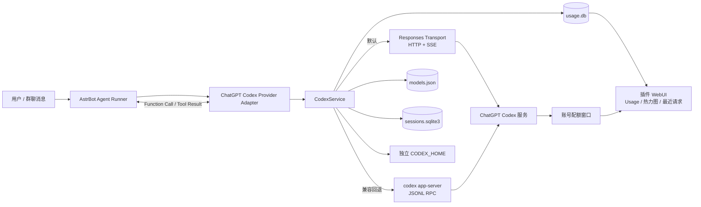
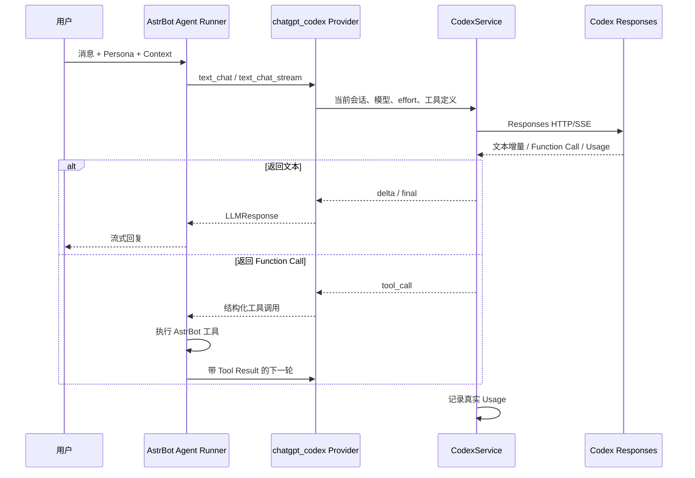
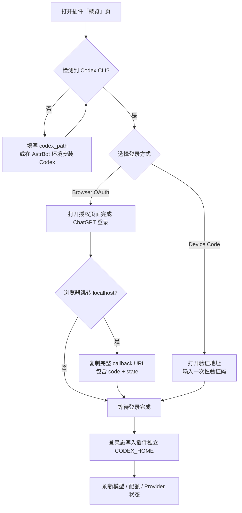
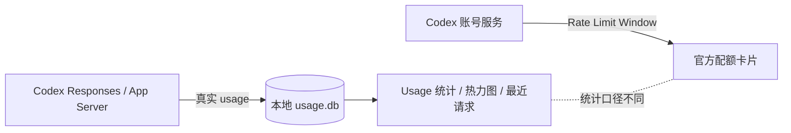
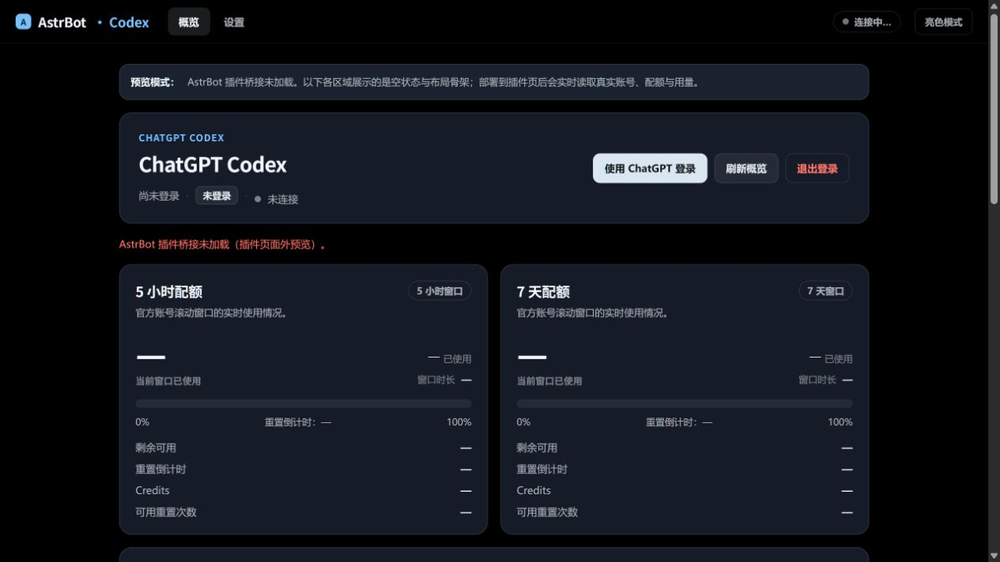
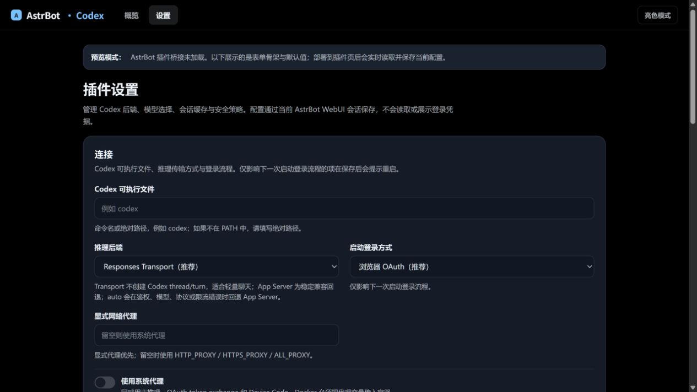

<div align="center">

# AstrBot ChatGPT Codex Bridge

**在 AstrBot 中直接使用当前 ChatGPT 账号可用的 Codex 模型。**<br>
基于官方 Codex 登录能力，提供轻量 Responses Transport、Codex App Server 回退、模型发现、配额读取、本地 Usage 统计与 AstrBot 原生工具调用桥接。

[](https://github.com/longzhou23/astrbot_plugin_chatgpt_codex/releases)
[](https://github.com/AstrBotDevs/AstrBot)
[](https://github.com/openai/codex)
[](https://github.com/longzhou23/astrbot_plugin_chatgpt_codex)

</div>

> [!IMPORTANT]
> 本插件使用 **ChatGPT 账号的 Codex 登录态**，不是 OpenAI API Key 代理。<br>
> ChatGPT Plus / Pro 等订阅与 OpenAI API 的额度、授权和计费体系彼此独立；实际可用模型、套餐和配额均以 Codex 服务端返回结果为准。

---

## ✨ 功能概览

- **AstrBot 原生 Provider**：注册 `chatgpt_codex` Provider Adapter，可直接作为 AstrBot 对话模型使用。
- **官方 ChatGPT 登录**：支持浏览器 OAuth 与 Device Code；无需复制 Cookie、Access Token 或 Refresh Token。
- **双后端设计**：
  - `transport`：默认推荐，直接通过 Codex Responses HTTP/SSE 推理；
  - `app_server`：使用官方 `codex app-server` Agent Loop；
  - `auto`：优先 Transport，失败时单次回退 App Server。
- **动态模型发现**：模型 ID 与 reasoning effort 均来自服务端 `model/list`，插件不硬编码模型列表。
- **流式响应**：在 AstrBot 支持时原生输出流式文本。
- **AstrBot 工具桥接**：结构化 function call 交还 AstrBot Agent Runner 执行，不在 Transport 内重复套第二层 Agent Loop。
- **多模态输入**：支持文本、图片、音频和工具调用输入；附件能力按当前 Codex 协议安全降级。
- **本地 Usage 面板**：统计输入、缓存输入、输出、reasoning、总 Token、缓存命中率、最近请求与年度热力图。
- **官方配额读取**：配额窗口与本地 Usage 分开显示，避免混淆统计口径。
- **轻量 Harness**：默认去除 coding-agent 场景下不必要的 prompt 来源，降低普通聊天的提示词开销。
- **安全默认值**：Codex 本机 shell、文件系统写入、MCP、browser/computer control 等能力默认关闭。
- **独立会话映射**：AstrBot 会话与 Codex thread 隔离，支持 thread 轮换、空闲 TTL、最大年龄和手动重置。

---

## 🧩 它是怎么工作的？



### 普通对话请求链



### 为什么没有“第二层 Agent Loop”？

AstrBot 本身已经有 Agent Runner。默认的 Transport 路径只负责模型推理和结构化工具调用转换：

```text
AstrBot Agent Runner
        │
        ├── Persona / System Prompt
        ├── Conversation Context
        ├── AstrBot Tools
        │
        ▼
ChatGPT Codex Provider
        │
        └── Responses Transport  ← 只负责推理，不再创建一套重复 Agent Loop
```

这样可以避免重复注入系统指令、重复执行工具循环，以及不必要的上下文膨胀。

---

## 🚀 安装

### 1. 安装 Codex CLI

首次登录依赖官方 Codex App Server，因此 **运行 AstrBot 的同一环境中必须存在可执行的 Codex CLI**。

macOS / Linux：

```bash
curl -fsSL https://chatgpt.com/codex/install.sh | sh
```

或使用 npm：

```bash
npm install -g @openai/codex
```

确认：

```bash
codex --version
```

如果 AstrBot 服务账号无法直接找到 `codex`，请在插件设置中将 `codex_path` 填为可执行文件的绝对路径。

### 2. 安装插件

```bash
git clone --branch v1.0.0 --depth 1 \
  https://github.com/longzhou23/astrbot_plugin_chatgpt_codex.git
```

将目录放入：

```text
AstrBot/data/plugins/astrbot_plugin_chatgpt_codex
```

然后重启 AstrBot。

插件初始化时会注册 `ChatGPT Codex Subscription` Provider；已有用户配置不会被覆盖。

---

## 🔐 首次登录

推荐直接使用插件 WebUI 完成初始化。



### Browser OAuth

1. 打开插件 **概览** 页面；
2. 点击 ChatGPT 登录；
3. 在浏览器中完成授权；
4. 如果最终跳转到了 `localhost`，把地址栏中的 **完整 URL** 粘贴回插件页面；
5. 等待页面显示账号已登录。

> [!WARNING]
> 回调地址必须包含完整的 `?code=...&state=...`。不要把该 URL、Token、Cookie 或 `CODEX_HOME/auth.json` 发到 Issue、群聊或普通日志中。

### Device Code

适合无图形界面的远程服务器。选择 `device_code` 后，插件会显示验证地址与一次性验证码，按页面提示完成授权即可。

---

## 🐳 Docker 部署

插件看到的是 **AstrBot 容器内部** 的 PATH 和文件系统，而不是宿主机环境。

进入实际运行 AstrBot 的容器检查：

```bash
docker compose exec astrbot sh
command -v codex
codex --version
```

如果使用自定义镜像，建议将 Codex CLI 写进 Dockerfile，而不是只在正在运行的容器中临时安装：

```dockerfile
RUN npm install -g --include=optional @openai/codex@0.149.1
```

插件的 `CODEX_HOME` 位于 AstrBot 持久化数据目录下，因此请确保 `/AstrBot/data` 被正确挂载。

如果需要网络代理，容器内的 `127.0.0.1` 指向 **容器自身**，不能直接代表宿主机代理。

---

## ⚙️ 后端模式

| 模式 | 推荐场景 | 推理链路 | Codex CLI 依赖 |
| --- | --- | --- | --- |
| `transport` | **默认推荐，普通聊天** | Responses HTTP/SSE | 首次登录需要；推理本身不启动 App Server |
| `app_server` | 兼容 / 稳定 Agent Loop | `codex app-server` JSONL RPC | 推理期间需要 |
| `auto` | 希望自动容错 | Transport 优先，失败后单次回退 App Server | 取决于最终后端 |

### `transport`

轻量路径，直接发送 Codex Responses 请求：

- 不创建 Codex thread / turn 作为 Transport 推理协议的一部分；
- 不启动 App Server 作为每次聊天的推理后端；
- 不暴露 Codex 本机 shell、文件系统、MCP 等能力；
- AstrBot 工具以 function call 形式返回给 AstrBot Agent Runner 执行；
- 适合机器人闲聊、群聊和普通 Agent 场景。

### `app_server`

通过官方 `codex app-server` 的 JSONL RPC 工作，负责 thread / turn 生命周期与流式响应。需要原生 Codex Agent Loop 或 Transport 出现兼容性问题时可显式切换。

### `auto`

先尝试 Transport；遇到认证、模型、协议、网络等后端失败时执行一次 App Server 回退，不会无限重试配额耗尽请求。

---

## 🪶 Lightweight Harness

默认：

```text
harness_mode = lightweight
```

该模式面向 AstrBot 聊天场景，关闭 Codex coding-agent 中不必要的提示词来源，例如：

- permissions instructions；
- apps instructions；
- collaboration mode instructions；
- skills instructions；
- environment context；
- project docs；
- memories；
- MCP servers；
- Codex app tools；
- `update_plan` / `request_user_input` 等可选工具。

同时使用一段最小基础指令，明确：遵循 AstrBot Persona / System Prompt，只使用本轮显式提供的工具，并且不假设拥有 shell、文件系统、浏览器或本机环境访问权。

如果确实需要原生 Codex coding-agent 行为，可以切换：

```text
harness_mode = codex
```

---

## 📊 Usage 与热力图

插件会把 **服务端真实返回的 usage** 写入本地 SQLite，而不是根据字符数或上下文长度估算 Token。

### 统计字段

| 字段 | 含义 |
| --- | --- |
| Input | 服务端返回的输入 Token |
| Cached input | Input 中命中缓存的子集 |
| Output | 输出 Token |
| Reasoning | Output 的 reasoning 分项 |
| Processed total | 服务端总 Token；不会额外重复加 Cached / Reasoning |
| Requests | 本地记录到的请求数量 |
| Cache ratio | `cached_input_tokens / input_tokens` |

> [!NOTE]
> `Cached input` 是 `Input` 的子集；`Reasoning` 是输出记账中的分项。它们不会再次叠加到 `Processed total`。

### 年度活动热力图

概览页会读取最长 365 天的按日 Usage，并渲染为 52 周活动网格：

```text
            Jan       Feb       Mar                    Aug
Mon         ■ ■       ■ ■ ■     ■                      ■ ■
Wed       ■ ■ ■       ■ ■       ■ ■                  ■ ■ ■
Fri         ■         ■ ■ ■       ■                    ■

          Less  ▫ ▪ ▪ ▪ ■  More
```

WebUI 支持：

- Daily：按日 Token；
- Weekly：同一周按周总量着色；
- Cumulative：窗口内累计 Token；
- 未来日期忽略；
- 缺失日期补零；
- 重复日期累计；
- 颜色等级相对于当前显示窗口峰值动态量化。

本地 Usage 与官方配额是 **两个不同数据源**：



因此两者出现差异是正常的，账号剩余额度应以服务端配额为准。

---

## 🧠 会话与上下文

插件将 AstrBot 的统一会话标识映射为独立 Codex thread / session 状态：

- 同一会话内请求串行；
- 不同会话允许并行；
- 无 `session_id` 的插件后台调用使用一次性临时会话键，不与普通聊天共享状态；
- 支持 `max_thread_turns`、`thread_idle_ttl`、`thread_max_age` 自动轮换；
- `/gpt reset` 可手动重置当前会话状态。

持久化数据示意：

```text
data/plugin_data/astrbot_plugin_chatgpt_codex/
├── CODEX_HOME/            # 独立 ChatGPT Codex 登录态
├── models.json            # 服务端模型目录缓存
├── runtime_settings.json  # 当前模型 / effort / onboarding 状态
├── sessions.sqlite3       # AstrBot 会话映射
└── usage.db               # 本地 Token Usage
```

---

## 🛠️ AstrBot 工具与多模态

Provider 声明支持：

```text
text / image / audio / tool_use
```

### 工具调用

Transport 返回 Function Call 时，插件将名称、参数和 Call ID 转换成 AstrBot `LLMResponse`，由 AstrBot Agent Runner 继续执行工具并把 Tool Result 带入下一轮。

这意味着：

- AstrBot 工具仍然由 AstrBot 控制；
- 插件不会自行执行未知本机命令；
- 工具调用历史和 opaque reasoning signature 会在需要时保留给后续 Responses 请求。

### 多模态

- 图片 → 转换为当前 Codex 协议的 `input_image`；
- 音频 → 转换为 `input_audio`；
- 回复 / 引用 → 保留为引用文本；
- 当前协议没有通用文件 / 视频 ContentItem 时 → 转为简短附件标记，不静默丢弃用户输入。

---

## 🔒 安全边界

默认安全策略：

| 能力 | 默认状态 |
| --- | --- |
| Codex 本机 shell | ❌ 关闭 |
| 文件系统写入 | ❌ 关闭 |
| Codex MCP | ❌ 关闭 |
| Browser / Computer Control | ❌ 关闭 |
| 本机 Codex Tools | ❌ `enable_local_codex_tools = false` |
| 隐藏思维链输出 | ❌ 不暴露 |
| Token / Cookie 普通日志 | ❌ 不记录 |
| 原始 OAuth URL 普通日志 | ❌ 不记录 |

插件会对用户可见错误与诊断信息执行脱敏。会话 ID 在 Usage 中使用 SHA-256 哈希保存，调试输出中的 thread / turn ID 也会掩码处理。

> [!CAUTION]
> `enable_local_codex_tools` 会扩大 AstrBot 进程可接触的本机能力面。除非你明确理解风险，否则保持关闭；如需测试，建议使用隔离环境。

---

## 🖥️ WebUI

插件提供两个主要页面：

### 概览

- ChatGPT 登录 / 退出；
- 当前账号与套餐；
- 5 小时 / 7 天等官方配额窗口；
- 当前后端与运行状态；
- 服务端模型；
- 今日 / 7 日 / 30 日本地 Usage；
- 缓存命中统计；
- 52 周 Token 活动热力图；
- 最近请求明细。

### 设置

- Codex CLI 路径；
- Backend Mode；
- OAuth / Device Code；
- Transport Proxy；
- 默认模型与 reasoning effort；
- Harness；
- Tool Router；
- 并发 / 超时；
- Thread 生命周期；
- Usage 时区与保留天数；
- 本机工具安全开关。

### 页面预览

下面是插件页面的实际布局预览。部署到 AstrBot 后，概览页会替换空状态并读取当前账号、官方配额和本地 Usage；设置页会读取并保存当前实例配置。





---

## ⚙️ 常用配置

| 配置项 | 默认值 | 说明 |
| --- | --- | --- |
| `codex_path` | `codex` | Codex 可执行文件名或绝对路径 |
| `backend_mode` | `transport` | `transport` / `app_server` / `auto` |
| `transport_proxy` | 空 | 显式代理地址，优先于系统代理 |
| `use_system_proxy` | `true` | 继承 `HTTP_PROXY` / `HTTPS_PROXY` / `ALL_PROXY` |
| `login_mode` | `browser` | `browser` / `device_code` |
| `default_model` | `auto` | 服务端模型 ID；`auto` 自动选择 |
| `reasoning_effort` | `auto` | 模型支持的 reasoning effort |
| `harness_mode` | `lightweight` | `lightweight` / `codex` |
| `tool_router` | `minimal` | `none` / `minimal` / `all` |
| `streaming` | `true` | 启用流式 Provider 调用 |
| `max_concurrent_turns` | `2` | 全局最大并发 turn |
| `turn_timeout` | `600` | 单次请求超时，秒 |
| `enable_local_codex_tools` | `false` | 是否允许 Codex 本机工具 |
| `usage_timezone` | `Asia/Shanghai` | Usage 自然日 IANA 时区 |
| `usage_retention_days` | `365` | Usage 记录保留天数；`0` 永久保留 |

<details>
<summary><b>展开全部高级配置</b></summary>

| 配置项 | 默认值 | 范围 / 说明 |
| --- | --- | --- |
| `show_tool_status` | `false` | 是否显示安全的公开工具状态标签 |
| `max_thread_turns` | `100` | `0` 关闭按完成 turn 数轮换 |
| `thread_idle_ttl` | `604800` | thread 空闲轮换时间，默认 7 天 |
| `thread_max_age` | `2592000` | thread 最大年龄，默认 30 天 |
| `force_http_transport` | `true` | 强制 ChatGPT 流量使用 HTTPS，避免 WebSocket 回退延迟 |
| `usage_debug` | `false` | 记录脱敏的数值 Usage 诊断，不记录 Prompt / Reply / Token |

</details>

模型列表与可用 reasoning effort 以当前账号的服务端返回为准。

---

## 💬 管理命令

```text
/gpt status
/gpt login
/gpt logout
/gpt models
/gpt model <id>
/gpt effort <level>
/gpt harness <lightweight|codex>
/gpt prompt-debug
/gpt quota
/gpt benchmark <transport|app_server>
/gpt usage [today|7d|30d|...]
/gpt usage debug
/gpt usage reset
/gpt reset
```

其中登录、退出登录、模型 / effort / harness 设置、benchmark、Usage 重置等敏感操作会按插件实现限制管理员权限。

`/gpt benchmark` 会发送一次真实请求，因此 **会产生实际用量**；它不会在启动时自动运行。

---

## 🌐 网络与代理

默认情况下插件可以继承 AstrBot 进程中的：

```text
HTTP_PROXY
HTTPS_PROXY
ALL_PROXY
```

也可通过：

```text
transport_proxy = http://127.0.0.1:7890
```

显式指定代理；显式配置优先级更高。

同一代理规则会用于：

- Browser OAuth token exchange；
- Device Code；
- Responses Transport；
- Codex App Server 相关网络访问。

不要在代理 URL 中写入用户名或密码。

---

## 📁 项目结构

```text
astrbot_plugin_chatgpt_codex/
├── main.py                 # AstrBot 插件入口、命令、Web API
├── agent_provider.py       # AstrBot Provider Adapter
├── codex_service.py        # 核心编排：认证、模型、后端、会话、Usage
├── codex_rpc.py            # App Server JSONL RPC
├── process_manager.py      # codex app-server 生命周期
├── session_store.py        # 会话持久化
├── model_catalog.py        # 服务端模型目录
├── harness.py              # Lightweight / Codex Harness 策略
├── tool_bridge.py          # 工具桥接
├── codex_security.py       # 错误与敏感信息脱敏
├── transport/
│   ├── auth.py             # CODEX_HOME OAuth 登录态读取 / 刷新
│   ├── client.py           # Responses HTTP/SSE 客户端
│   ├── responses.py        # 请求 / SSE / 多模态 / Function Call 转换
│   ├── quota.py            # Rate Limit 解析
│   └── types.py            # Transport 类型与错误
├── usage/
│   ├── collector.py        # Usage 采集
│   ├── storage.py          # SQLite 存储
│   ├── aggregate.py        # 聚合 / Cache Ratio / Heat Level
│   ├── service.py          # Summary / Daily / Model / Recent Turns
│   └── models.py           # Token Usage 数据模型
├── pages/
│   ├── account/index.html  # 概览 / 登录 / 配额 / Usage 热力图
│   └── settings/index.html # 设置页
├── tests/                  # 单元测试
├── scripts/
│   └── benchmark_prompt_overhead.py
├── _conf_schema.json       # AstrBot 插件配置 Schema
└── metadata.yaml           # 插件元数据
```

---

## ❓ 常见问题

### `No such file or directory: 'codex'`

运行 AstrBot 的用户 / 容器无法找到 Codex CLI。先在 **同一运行环境** 中执行：

```bash
codex --version
```

若命令存在但 AstrBot PATH 不同，在插件中填写 `codex_path` 绝对路径。

### OAuth 最后跳转 `localhost`，但服务器没有登录成功

远程服务器场景下，浏览器的 `localhost` 是你当前电脑，不是服务器。复制浏览器地址栏的 **完整 callback URL** 回插件 WebUI 提交即可。

### Transport 请求失败或很慢

依次检查：

1. AstrBot 进程是否能访问外网；
2. 系统代理是否真正传入 AstrBot / Docker；
3. `transport_proxy` 是否使用了容器可访问地址；
4. 尝试将 `backend_mode` 改为 `app_server`；
5. 若希望自动回退，使用 `auto`。

### Usage 为什么是 0 / Unavailable？

插件只记录服务端真实返回的 usage。没有 usage 的历史请求不会根据字符数补算，也不会伪造 Token 数。

### 本地 Usage 为什么和账号配额对不上？

二者统计来源不同：本地 Usage 是插件观察到的请求，官方配额是账号服务端窗口。时间范围、刷新时机和记账口径均可能不同。

### 为什么 Plus 账号不能当 API Key 用？

因为 ChatGPT 订阅与 OpenAI API 是两套独立产品。本插件只桥接当前 ChatGPT 账号实际拥有的 Codex 能力，不提供 API 余额转换。

---

## 🧪 开发与测试

```bash
python -m pytest -q
ruff check .
python -m compileall -q .
git diff --check
```

Prompt 开销基准工具：

```bash
python scripts/benchmark_prompt_overhead.py --help
```

测试覆盖认证安全、Provider、缓存优化、Harness、模型目录、OAuth、进程管理、RPC、Transport、会话、Usage 等核心模块。

---

## ✅ 正式版状态

当前版本：**`v1.0.0`**。

需要注意：

- Responses Transport 依赖当前 Codex 客户端 / 服务端协议形状，未来可能随上游变化；
- `app_server` 保留作为兼容回退；
- Transport 工具循环仍由 AstrBot Agent Runner 负责；
- 插件不能增加、绕过或修改账号官方配额；
- 账号实际开放的模型与 reasoning effort 始终以服务端为准。

---

## 🐛 反馈

项目地址：<https://github.com/longzhou23/astrbot_plugin_chatgpt_codex>

提交 Issue 时建议附上：

- AstrBot 版本；
- Codex CLI 版本；
- 插件版本；
- `backend_mode`；
- 脱敏后的错误日志；
- 能稳定复现问题的最小步骤。

**请勿提交：** Access Token、Refresh Token、Cookie、完整 OAuth Callback URL、`CODEX_HOME/auth.json` 或其他个人凭据。

---

<div align="center">

**ChatGPT account → Codex → AstrBot，尽量少一层，尽量保持原生。**

</div>
